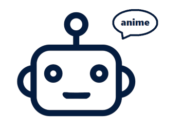
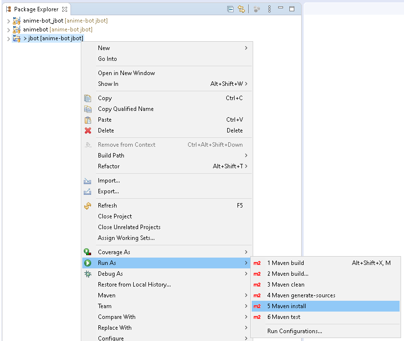
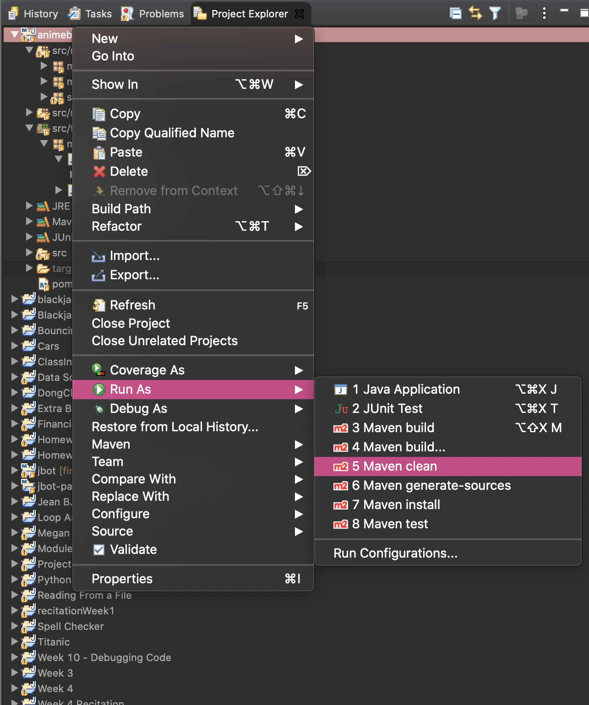
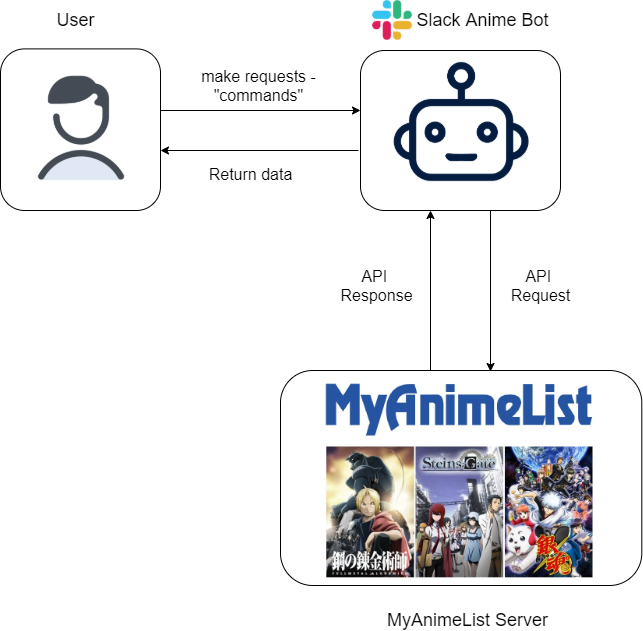

---
# MCIT 591 Final Project
__Team 29 - Slack Anime Bot__

Bringing joy to Otaku everywhere since 2020

---
## Introduction
Who, what, where, and why (see Technical Specifications below for how)
### Who is Team 29
Team 29 is a group of three intelligent, enthusiastic students who are taking MCIT 591 during Spring 2020 at the prestigious University of Pennsylvania

[Andrea Mackie](https://github.com/andreamackie13)

[Brian Chan](https://github.com/chan-b)

[Gulcin Ennis](https://github.com/G-Ennis)

### Why Anime
During the Coronavirus Lockdown of 2020, there's no more relaxing way to pass the time than to watch Anime and read Manga

Yes, we do Manga too!

---
## Quick-Start Guide
Here in case you need it
### Software Prerequisites
* Eclipse
* JRE Library
* JUnit Library
* M2Eclipse
* Git

### Getting Started
Follow these instructions to quickly get the animebot up and running:
1. Clone this project: `git clone https://github.com/UPenn-CIT599/final-project-team29_animebot.git anime-bot`
2. Open the anime-bot project in Eclipse. It should import three projects: the parent (jbot) and two nested modules (anime-bot_jbot and animebot)
3. Right-click on the jbot project module and select Run As > Maven install

Click here: Maven Install

3. Right-click on the animebot project module and select Run As > Maven clean

Click here: Maven Clean

4. Right-click on the animebot project module and select Run As > Maven build...

Click here: Maven build

5. Under Goals, enter `spring-boot:run` and click Run

Click here: Edit Configuration

6. Login to the Slack Workspace: https://591finalproject.slack.com

Click here: Slack Workspace Credentials

__Username:__ `mcit591.team29@gmail.com` 
__Password:__ `mcit591!`

7. Navigate to the bot channel
8. You're now ready to talk with our animebot!

---
## How to Interact
Now that the Slack Anime Bot is up and running, try talking to it!
### Available Commands
Below is a list of commands you can use to interact with our animebot:
* @animebot
* get manga
* get top anime
* get top manga
* anime search
* manga search

And any questions you would like to ask AnimeBot! Try the questions below:
* What are the episodes for (enter anime in question here)?
* Is (anime) still airing episodes?
* What is the status for (anime/manga)?
* How many episodes does (anime) have?
* When did (anime) premiere?
* What was the inspiration behind (anime)?
* What is the trailer for (anime)?
* Give me more details about (anime).
* What are the reviews for (anime)?
* What is the English title for (anime)?
* What is the prequel for (anime/manga)?
* What are the sequels for (anime)?
* Show me pictures for (anime/manga)
* Give me recs for (anime/manga)
* How many users loved (anime)?
* How popular is (anime)?
* Are there any news articles for (anime)?
* How many chapters does (manga) have?
* How many people scored (manga)
* What is the score for (anime/manga)
* What is the synopsis for (anime/manga)
* How many volumes does (manga) have?
* Is (manga) still publishing new manga?
* Was the manga better than the anime for (title)?

---
## Technical Specifications
How this all works.
### Overview
Our Slack Anime Bot is based on the [JBot Framework](https://github.com/rampatra/jbot)   
JBot is an event driven, Java framework that is available with all the boilerplate code which handles the underlying WebSocket connections and other complexities   
Bots interact with Slack through WebSockets, specifically the RTM API   
The JBot Framework code is contained in the jbot project folder. Team 29 is responsible for all code in the animebot module   

We leverage the [Jikan API](https://jikan.moe/) to fetch information from MyAnimeList.net   
Jikan is an unofficial MyAnimeList API. It uses an open-source PHP & REST API for the “most active online anime + manga 
community and database” — MyAnimeList. It parses the website to satisfy the need for an API

In general, an Application Program Interface (API) is a set of routines, protocols, and tools for building software applications. 
An API specifies how software components should interact. In simple terms, it is a software intermediary that allows two applications to talk to each other. 

 

---
## Known Issues
Unfortunately, things don't always go according to plan. Fortunately, we know what to do
### Installation

I don't see three projects when I open the local repository in Eclipse

Try deleting the local repository and re-cloning it from GitHub

Maven install or Maven build fails when compiling the JUnit tests

You may need to remove and re-add the JUnit Library to the animebot project Build Path for the code to compile

